# Paso 1. Crear la base de datos

En este paso crearemos una base de datos llamada 'EcommerceDB'

```sql
 CREATE DATABASE EcommerceDB;
 GO

 USE EcommerceDB;
 GO
```
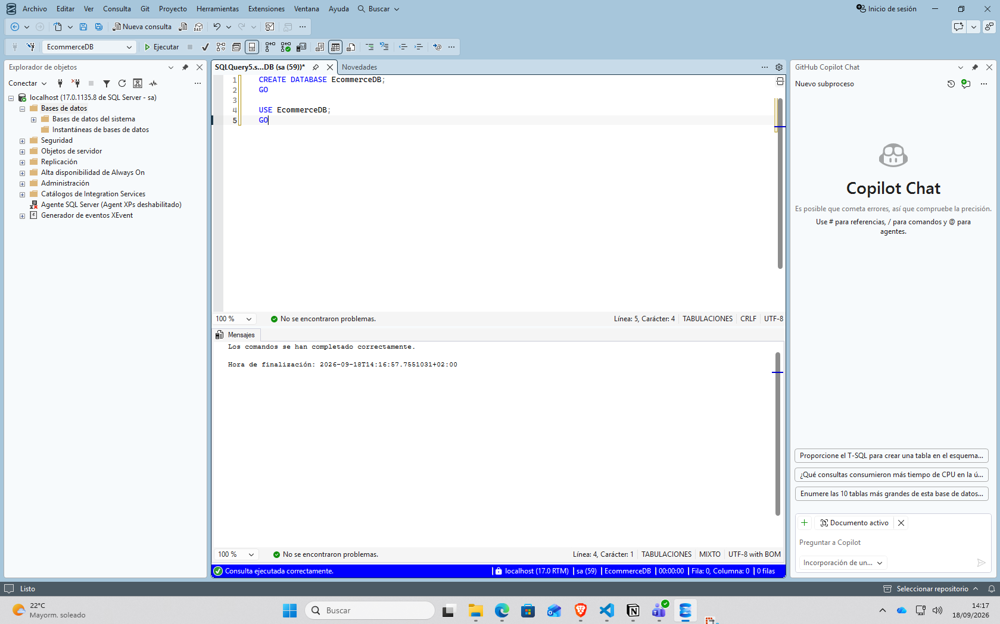

# Paso 2. Crear las tablas

En este paso crearemos 3 tablas Supplier, Category, Product

```sql
 USE EcommerceDB;
 GO

 -- Create Supplier table
 CREATE TABLE Supplier (
     SupplierID INT PRIMARY KEY IDENTITY(1,1),
     SupplierName NVARCHAR(100) NOT NULL UNIQUE,
     Country NVARCHAR(50) NOT NULL,
     Email NVARCHAR(100),
     Phone NVARCHAR(20),
     CreatedDate DATETIME2 DEFAULT GETUTCDATE()
 );

 -- Create Category table
 CREATE TABLE Category (
     CategoryID INT PRIMARY KEY IDENTITY(1,1),
     CategoryName NVARCHAR(100) NOT NULL UNIQUE,
     Description NVARCHAR(500)
 );

 -- Create Product table with constraints
 CREATE TABLE Product (
     ProductID INT PRIMARY KEY IDENTITY(1,1),
     ProductName NVARCHAR(100) NOT NULL,
     CategoryID INT NOT NULL,
     SupplierID INT NOT NULL,
     BasePrice DECIMAL(10,2) NOT NULL,
     StockQuantity INT NOT NULL DEFAULT 0,
     CreatedDate DATETIME2 DEFAULT GETUTCDATE(),
     CHECK (BasePrice > 0),
     CHECK (StockQuantity >= 0),
     FOREIGN KEY (CategoryID) REFERENCES Category(CategoryID),
     FOREIGN KEY (SupplierID) REFERENCES Supplier(SupplierID),
 );

 -- Create indexes
 CREATE INDEX IX_Category ON Product(CategoryID);
 CREATE INDEX IX_Supplier ON Product(SupplierID);

 GO
```

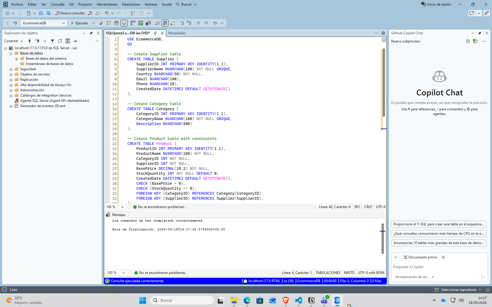

# Paso 3. Insertar datos en las tablas

En este paso insertaremos datos de ejemplo en las tablas para trabajar con ellos.

```sql
 USE EcommerceDB;
 GO

 -- Insert sample suppliers
 INSERT INTO Supplier (SupplierName, Country, Email, Phone)
 VALUES 
     ('Contoso Supplies', 'USA', 'contact@contoso.com', '555-0100'),
     ('Fabrikam Inc', 'Canada', 'sales@fabrikam.com', '555-0200');

 -- Insert sample categories
 INSERT INTO Category (CategoryName, Description)
 VALUES 
     ('Electronics', 'Electronic devices and accessories'),
     ('Clothing', 'Apparel and fashion items');

 -- Insert sample products
 INSERT INTO Product (ProductName, CategoryID, SupplierID, BasePrice, StockQuantity)
 VALUES 
     ('Wireless Mouse', 1, 1, 29.99, 100),
     ('Cotton T-Shirt', 2, 2, 19.99, 250);
 GO
```

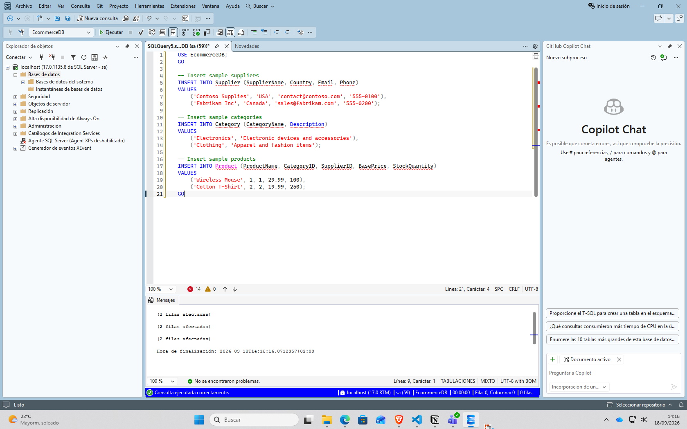

# Paso 4. Crear una tabla temporal

En este paso creamos una tabla temporal

 ```sql
USE EcommerceDB;
 GO

 -- Create Price History table with temporal versioning
 CREATE TABLE ProductPrice (
     PriceID INT PRIMARY KEY IDENTITY(1,1),
     ProductID INT NOT NULL,
     CurrentPrice DECIMAL(10,2) NOT NULL,
     EffectiveDate DATE,
     SysStartTime DATETIME2 GENERATED ALWAYS AS ROW START HIDDEN,
     SysEndTime DATETIME2 GENERATED ALWAYS AS ROW END HIDDEN,
     PERIOD FOR SYSTEM_TIME (SysStartTime, SysEndTime),
     FOREIGN KEY (ProductID) REFERENCES Product(ProductID)
 ) WITH (SYSTEM_VERSIONING = ON);
 GO

 -- Insert initial price data
 INSERT INTO ProductPrice (ProductID, CurrentPrice, EffectiveDate)
 VALUES (1, 99.99, '2025-01-01'), (2, 149.99, '2025-01-01');

 -- Update price (creates history entry)
 UPDATE ProductPrice SET CurrentPrice = 109.99 WHERE ProductID = 1;
 GO
```

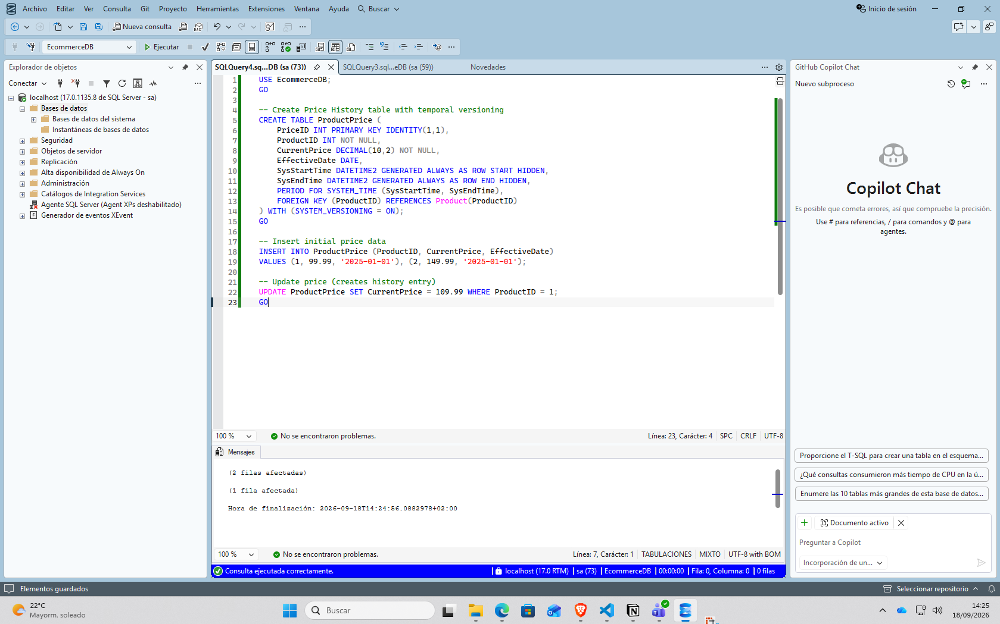

# Paso 5. Consulta el historial de precios

En este paso realizamos una consulta para ver el historial de los precios

```sql
 USE EcommerceDB;
 GO

 -- Query price history
 SELECT ProductID, CurrentPrice, SysStartTime, SysEndTime
 FROM ProductPrice
 FOR SYSTEM_TIME ALL
 WHERE ProductID = 1;
```

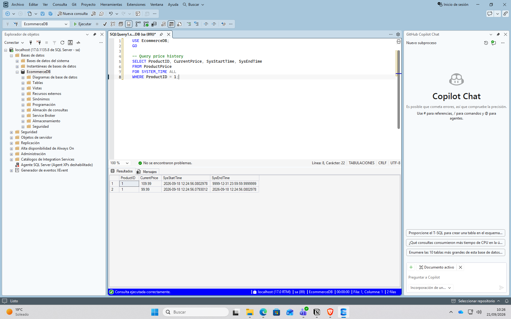

# Paso 6. Añadir metadata JSON

En este paso guardamos los metadatos en json para facilitar que las busquedas por color.

```sql
USE EcommerceDB;
 GO

 -- Add metadata column to Product (JSON type requires SQL Server 2025)
 ALTER TABLE Product ADD Metadata JSON;
 GO

 -- Add computed column for indexing
 ALTER TABLE Product ADD MetadataColor AS JSON_VALUE(Metadata, '$.color');
 GO

 -- Create index on the computed column
 CREATE NONCLUSTERED INDEX IX_Product_Metadata_Color
     ON Product (MetadataColor);
 GO

 -- Update products with metadata
 UPDATE Product SET Metadata = N'{"color":"blue","size":"large","material":"cotton"}'
 WHERE ProductID = 1;

 UPDATE Product SET Metadata = N'{"color":"red","size":"small","material":"silk"}'
 WHERE ProductID = 2;
 GO
```

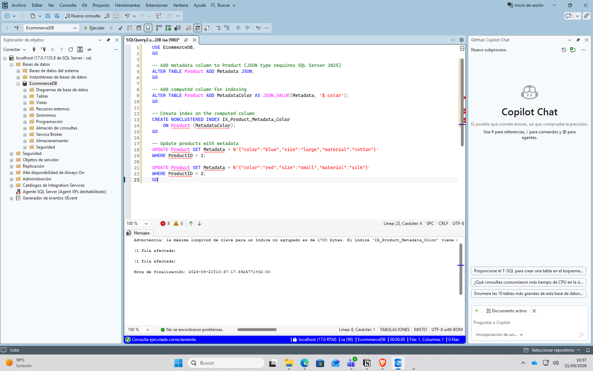

# Paso 7. Consultar los datos JSON

En este paso probaremos si funcionan las consultas sobre los metadatos que añadimos en json.

```sql
 USE EcommerceDB;
 GO

 -- Query JSON data
 SELECT 
     ProductID,
     ProductName,
     JSON_VALUE(Metadata, '$.color') AS Color,
     JSON_VALUE(Metadata, '$.size') AS Size,
     JSON_VALUE(Metadata, '$.material') AS Material
 FROM Product
 WHERE JSON_VALUE(Metadata, '$.color') = 'blue';
```

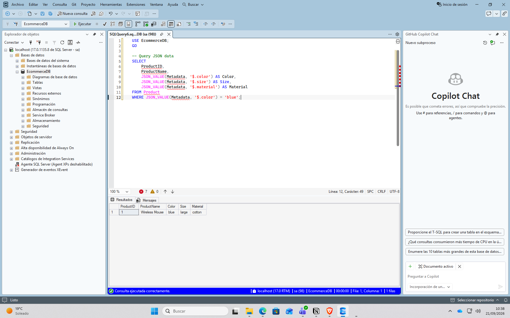

# Paso 8. Crear una tabla particionada

En este paso creamos particiones para poder trabajar solo con los datos que necesitamos.

```sql
 USE EcommerceDB;
 GO

 -- Create partition function for order dates
 -- Use RANGE RIGHT for date columns to keep same-day values together
 CREATE PARTITION FUNCTION PF_OrderDate (DATE)
     AS RANGE RIGHT FOR VALUES 
     ('2025-01-01', '2025-04-01', '2025-07-01', '2025-10-01');

 -- Create partition scheme (single filegroup recommended)
 CREATE PARTITION SCHEME PS_OrderDate
     AS PARTITION PF_OrderDate ALL TO ([PRIMARY]);

 -- Create partitioned Order table
 -- Include OrderDate in primary key for clustered index alignment
 CREATE TABLE [Order] (
     OrderID BIGINT IDENTITY(1,1),
     OrderDate DATE NOT NULL,
     CustomerName NVARCHAR(100) NOT NULL,
     TotalAmount DECIMAL(12,2) NOT NULL,
     OrderStatus NVARCHAR(20) DEFAULT 'Pending',
     CONSTRAINT PK_Order PRIMARY KEY (OrderID, OrderDate),
     CHECK (TotalAmount > 0),
     CHECK (OrderStatus IN ('Pending', 'Processing', 'Shipped', 'Delivered', 'Cancelled'))
 ) ON PS_OrderDate(OrderDate);

 -- Create partitioned index
 CREATE NONCLUSTERED INDEX IX_Order_Customer
     ON [Order](CustomerName)
     ON PS_OrderDate(OrderDate);
 GO

 -- Insert sample orders
 INSERT INTO [Order] (OrderDate, CustomerName, TotalAmount, OrderStatus) VALUES
     ('2025-01-15', 'John Smith', 299.97, 'Delivered'),
     ('2025-02-20', 'Jane Doe', 149.99, 'Shipped'),
     ('2025-06-10', 'Bob Johnson', 449.95, 'Processing');
 GO
```

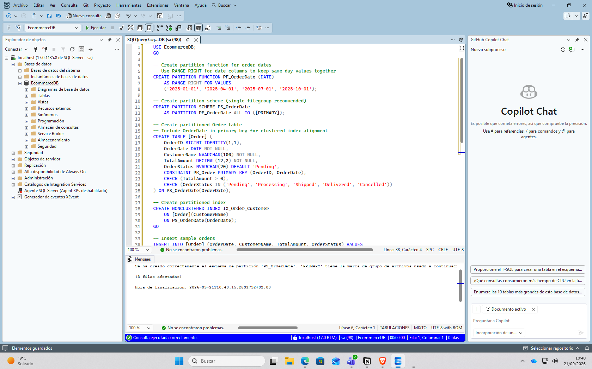

# Paso 9. Consultar las particiones

En este paso consultamos en las particiones que hemos creado para determinar en qué partición se encuentra cada pedido.

```sql
 USE EcommerceDB;
 GO

 -- Query by partition
 SELECT 
     $PARTITION.PF_OrderDate(OrderDate) AS PartitionNumber,
     COUNT(*) AS OrdersInPartition,
     MIN(OrderDate) AS MinDate,
     MAX(OrderDate) AS MaxDate
 FROM [Order]
 GROUP BY $PARTITION.PF_OrderDate(OrderDate);
```

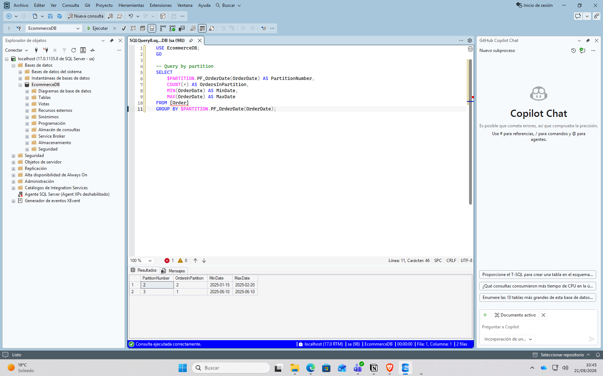

# Paso 10. Crear una SEQUENCE y OrderDetail

En este paso creamos una SEQUENCE para generar números de forma incremental, y luego OrderDetail que representa las líneas individuales de cada pedido.

```sql
 USE EcommerceDB;
 GO

 -- Create SEQUENCE for order line items
 CREATE SEQUENCE OrderLineSequence
     START WITH 1
     INCREMENT BY 1;

 -- Create OrderDetail table
 CREATE TABLE OrderDetail (
     OrderLineID INT PRIMARY KEY,
     OrderID BIGINT NOT NULL,
     OrderDate DATE NOT NULL,
     ProductID INT NOT NULL,
     Quantity INT NOT NULL,
     UnitPrice DECIMAL(10,2) NOT NULL,
     LineTotal AS (Quantity * UnitPrice),
     CHECK (Quantity > 0),
     CHECK (UnitPrice > 0),
     FOREIGN KEY (OrderID, OrderDate) REFERENCES [Order](OrderID, OrderDate),
     FOREIGN KEY (ProductID) REFERENCES Product(ProductID)
 );
 GO

 -- Insert order details using SEQUENCE
 INSERT INTO OrderDetail (OrderLineID, OrderID, OrderDate, ProductID, Quantity, UnitPrice)
 VALUES 
     (NEXT VALUE FOR OrderLineSequence, 1, '2025-01-15', 1, 2, 99.99),
     (NEXT VALUE FOR OrderLineSequence, 1, '2025-01-15', 2, 1, 149.99),
     (NEXT VALUE FOR OrderLineSequence, 2, '2025-02-20', 1, 3, 99.99);
 GO
```

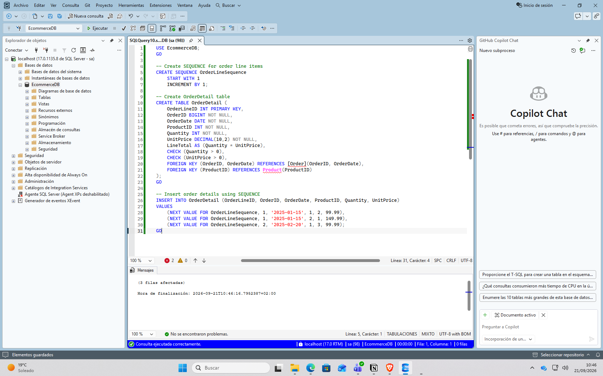


# Paso 11. Comprobar OrderDetail

En este paso comprobamos los registros de OrderDetail

```sql
 USE EcommerceDB;
 GO

 SELECT * FROM OrderDetail;
```

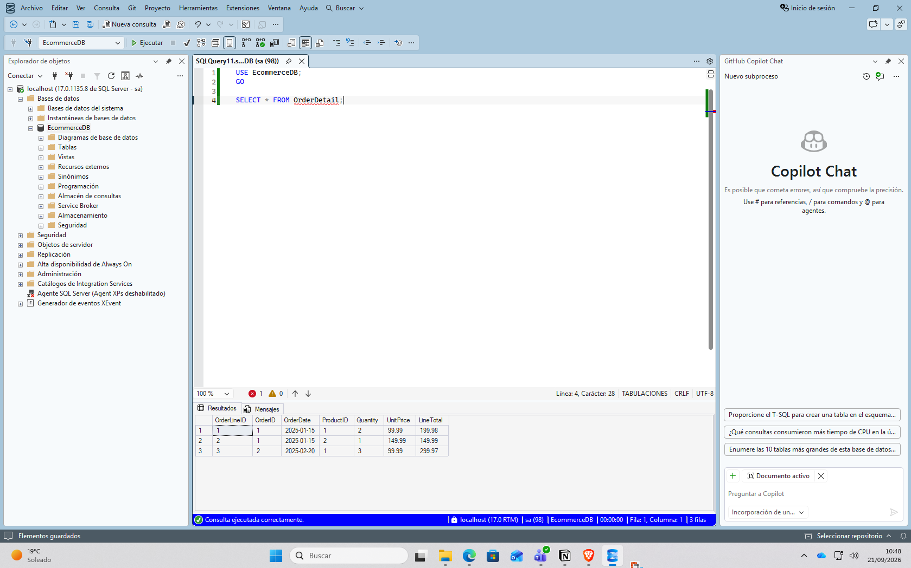

# Paso 12. Comprobar que funcionan los constraints

En este paso se comprobará si el constraint funciona.

```sql
 USE EcommerceDB;
 GO

 -- Verify constraints work
 -- This should fail: negative price
 INSERT INTO Product (ProductName, CategoryID, SupplierID, BasePrice, StockQuantity)
 VALUES ('Invalid', 1, 1, -50, 10);
```

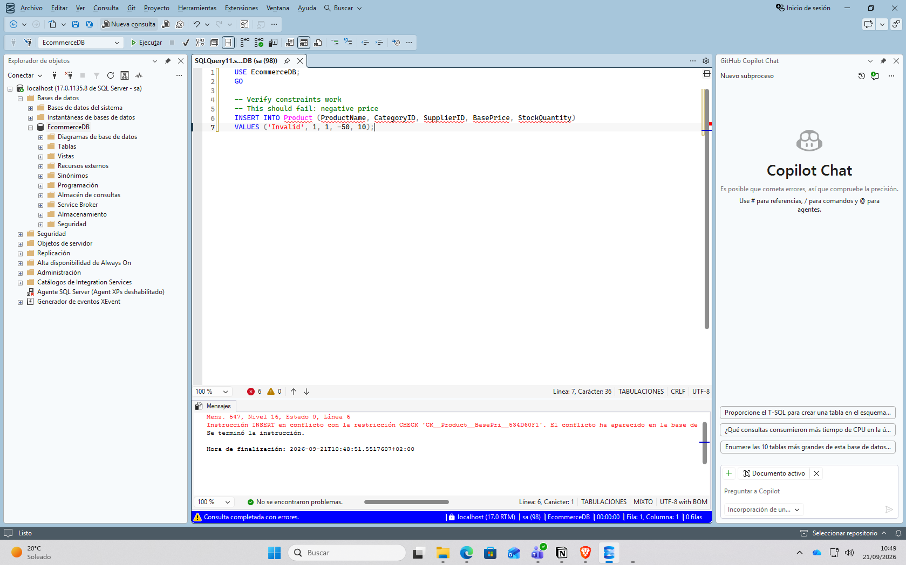

# Paso 13. Verificación final

En este ultimo paso se verificará el json, el particionamiento y la tabla temporal.

```sql
 USE EcommerceDB;
 GO

 -- Verify JSON queries work
 SELECT ProductName, JSON_VALUE(Metadata, '$.color') AS Color
 FROM Product
 WHERE Metadata IS NOT NULL;

 -- Verify partitioning
 SELECT $PARTITION.PF_OrderDate(OrderDate) AS Partition, COUNT(*) AS RecordCount
 FROM [Order]
 GROUP BY $PARTITION.PF_OrderDate(OrderDate);

 -- Verify temporal table
 SELECT ProductID, CurrentPrice, SysStartTime, SysEndTime
 FROM ProductPrice FOR SYSTEM_TIME ALL
 ORDER BY ProductID, SysStartTime;
```

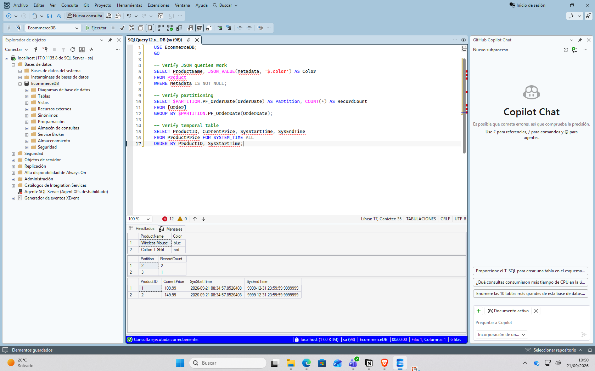